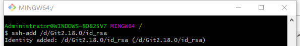
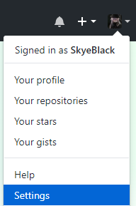
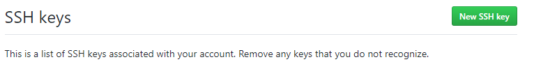
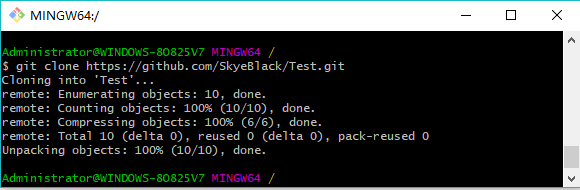
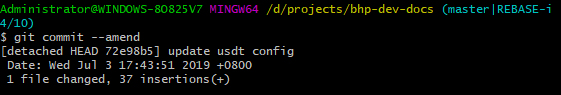
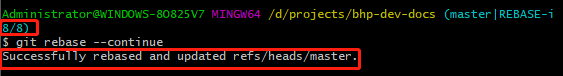
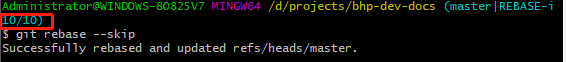

# 注册账号
https://github.com/
默认操作下一步直到结束，可能第一步需要反复操作才能成功
# 下载安装Git
https://git-scm.com/downloads
# 生成秘钥
打开git-bash
$ ssh-keygen -t rsa -C "youremail@youremail.com"
# 添加秘钥

 1. 先确认ssh-agent处于启用状态：eval “$(ssh-agent -s)”
 2. 输出类似于：Agent pid 32070
 3. 然后将SSH key添加到ssh-agent：ssh-add ~/.ssh/id_rsa
 4. 这时又会要你输入密码：Enter passphrase for /home/xxx/.ssh/id_rsa: 输入刚才记起来的密码

# 添加配置

复制.pub的`所有内容`到key并保存

# 配置git
这是全局配置，可以不配置
$ git config --global user.name "your name"
$ git config --global user.email "your_email@youremail.com"
# 检出仓库
可以使用客户端：[https://desktop.github.com/](https://desktop.github.com/)
也可以使用git-bash

# 修改commit注释
## 修改最后一次注释
如果你只想修改最后一次注释（就是最新的一次提交），那好办：
`git commit --amend`
出现有注释的界面（你的注释应该显示在第一行）， 输入`i`进入修改模式，修改好注释后，按`Esc`键 退出编辑模式，输入`:wq`保存并退出。ok，修改完成。
## 修改之前的某次注释
 1. 输入：
`git rebase -i HEAD~2`
最后的数字`2`指的是显示到倒数第几次，比如这个输入的2就会显示倒数的两次注释（最上面两行）

 2. 修改状态
将要修改的注释前面的`pick`换成`edit`。
方法就是上面说的编辑方式：`i`---编辑，把`pick`换成`edit`---`Esc`---`:wq`.
3. 修改注释：
`git commit --amend`

`i`---编辑，修改好后`Esc`---`:wq`.
4. 继续修改：
`git rebase --continue`

5. 跳过修改：
`git rebase --skip`

6. 修改完成
`git pull`
`git push`

