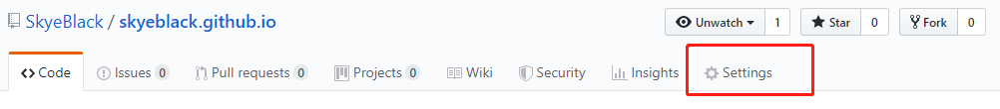
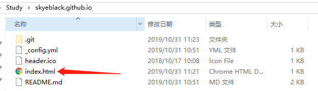
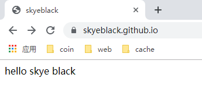
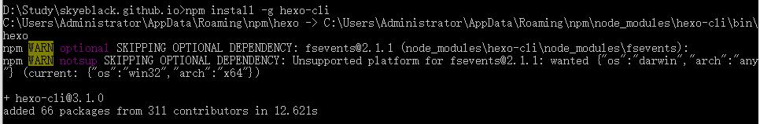
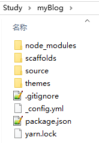
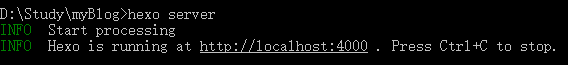
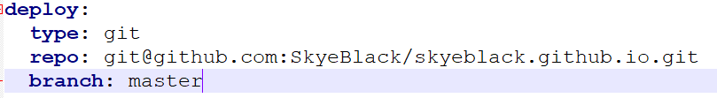
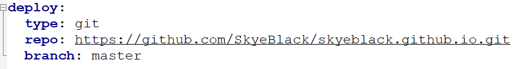

# 新建仓库

仓库名一定是  `用户名.github.io`

# 开启github page

默认开启

选择主题

`选择完成后即可通过上面的网址访问：https://skyeblack.github.io/`

# 修改网页
添加一个index.html网页

提交代码到github，刷新个人网址：`https://skyeblack.github.io/`

# HEXO
## 全局安装hexo
`npm install -g hexo-cli`

## 新建网站
`不要跟github.io放同一个仓库，把源码和网站分开`

`hexo init [folder]`

 - folder 博客源码程序目录

## 启动服务
`hexo server`

## 安装依赖
`npm install hexo-deployer-git --save`
## 修改_config.yml
`配置到博客仓库目录去，不是源码仓库`

`提交到另一项目用下面这种方式`

 - repo 自己的博客路径
 - branch 博客的分支，由于github限制必须在master，所以不能改
## 提交
`源码用git提交，但是博客代码不要用github的提交`
`hexo d -g`

